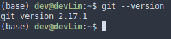
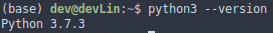
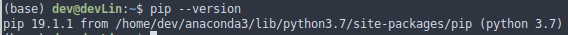

# jpeg_to_pdf_combiner
Process folder with `.jpeg` files and convert them into single `.pdf` file

Title: `.jpeg` to `.pdf` combiner

**Combine .jpg files in the target folder to single .pdf file**

**Input:** folder with .jpeg files subfolder output filename
 ex. python jpegToPdf.py /myfolder/ subfolder/ result.pdf

**Output:** `result.pdf` that incorporate all `.jpeg` files from the sourse
folder

Table of content
================

-   Description
    -   Problem
    -   Goal
    -   Solution
-   Getting Started
-   Prerequisites
-   Installing
    -   Install and Run GitHub
    -   Install Python 3
    -   Install package manager `pip`
    -   Set up virtual environment
        -   Create virtual environment for project
    -   Clone repository from GitHub to environment
    -   Install necessary packages

Credits

Description
-----------

### Problem

Documents have been scanned and stored into the folder.
One `.pdf` file should be build incorporating all the scanned `.jpeg` files

### Goal

Create single `.pdf` file incorporating all the scanned images from the
source folder.

### Solution

Design jpegToPdf.py software product for converting `.jpeg` files into single `.pdf` file.

example of execution:
   python jpegToPdf.py /myfolder/ result/ output.pdf

The execution of this command creates subfolder `result` in the `myfolder`. Process all `.jpeg` files in the `myfolder` and put converted `.pdf` files into `result`
subfolder. Then all  `.pdf` files incorporated into single `output.pdf` file.

Getting Started
---------------

These instructions will get you a copy of the project up and running on
your local machine for testing purpose. See deployment part for notes on
how to deploy the project on a live system.

Prerequisites
-------------

-   Linux - Ubuntu
-   GitHub
-   Python v 3.x
-   pip (package manager)
-   Virtual environment package 'venv' to distinguish the project from
    other ones
-   Pillow library from pypi.org
-   PyPDF4 library from pypi.org
-   Terminal

Installing
----------

Feel free to skip the step if you already have the tool installed

### Install and Run GitHub

> `` ` sudo apt-get update sudo apt-get install git `` class="title-ref"> verify the installation was successful by typing
> \`github --version
>
> 

### Install Python 3

> Python 3 is installed in Linux. verify the installation by typing
> python3 --version
>
> 

### Install package manager `pip`

> `` ` sudo apt-get update sudo apt-get install python3-pip `` class="title-ref"> verify the installation was successful by typing
> \`pip --version
> 

### Set up virtual environment

> `` ` sudo apt-get install python3-venv ``\`

#### Create virtual environment for project

Create and activate virtual environment

:   `` ` python -m venv ./venv/project-folder source bin/activate `` as the virtual environment is activated you'll
    see the name of your environment first in the command prompt like
    where \`jpeg_to_pdf_combiner` is the name of the virtual environment

    

### Clone repository from GitHub to environment

> `` ` git clone link-to-repository ``\` verify that you have the project in your folder
>

### Install necessary packages

> `` ` pip install -r jpeg_to_pdf_combiner/requirements.txt ``\`

**Congratulations, your environment is ready to test!!!**

Credits
-------

Thanks to Alex Clark and Team for the Pillow library https://pypi.org/project/Pillow/ ,
 Phaseit, Inc. for the PyPDF4 library https://pypi.org/project/PyPDF4/